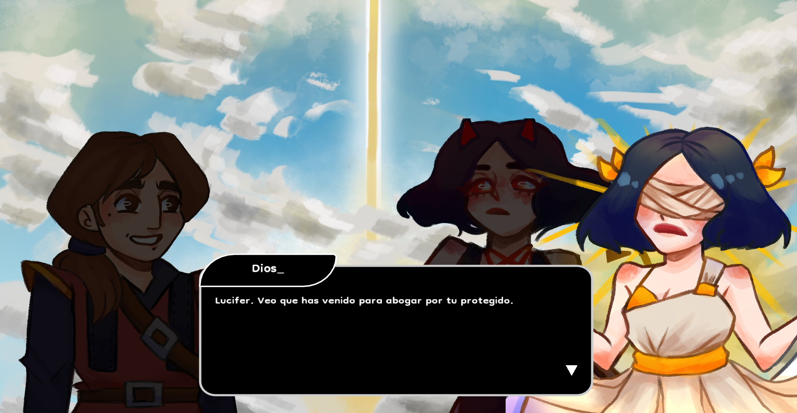
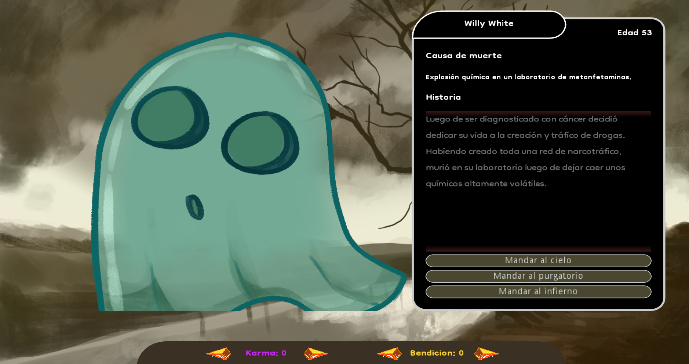

# Judgement of the Lost Souls - Global Game Jam 2022

Entry game for the event Global Game Jam 2022. [Official site to the game](https://globalgamejam.org/2022/games/judgement-lost-souls-8)

## Description
**The Judgement of the Lost Souls** is a 2d narrative adventure where you will play as Dante who wants to see once more his beloved Beatriz, to achieve this, you must first replace Saint Peter in his work of judging souls.

Depending on your decisions you will get different endings.

## Installation

### Requirements:
- [Godot Engine (Mono version) 3.4.2 or higher](https://godotengine.org/download)
- [.NET SDK 6.0 or higher](https://dotnet.microsoft.com/en-us/download)

1. Download and set up all the requirements
2. Git clone it
3. Open it with Godot Engine

```bash
$ git clone https://github.com/llanillo/GGJ-2022-Judgment-of-lost-souls
```
**Note:** In case you are getting 'Script not found exception', then go to Project > Tools > C# > Generate solution

## Play
Download and play it [here](https://github.com/llanillo/GGJ-2022-Judgment-of-lost-souls/releases/tag/v1.0.0)


## Screenshots



## Credits
This would not have been possible without these **wonderful people**

[Characters Artist](https://www.instagram.com/onlinelova_/)

[Background Artist](https://www.linkedin.com/in/fede-gramajo-68741a143/)

[Music/Sound](https://www.instagram.com/fonts.tg/)

Story Writer - Tomas Heredia
